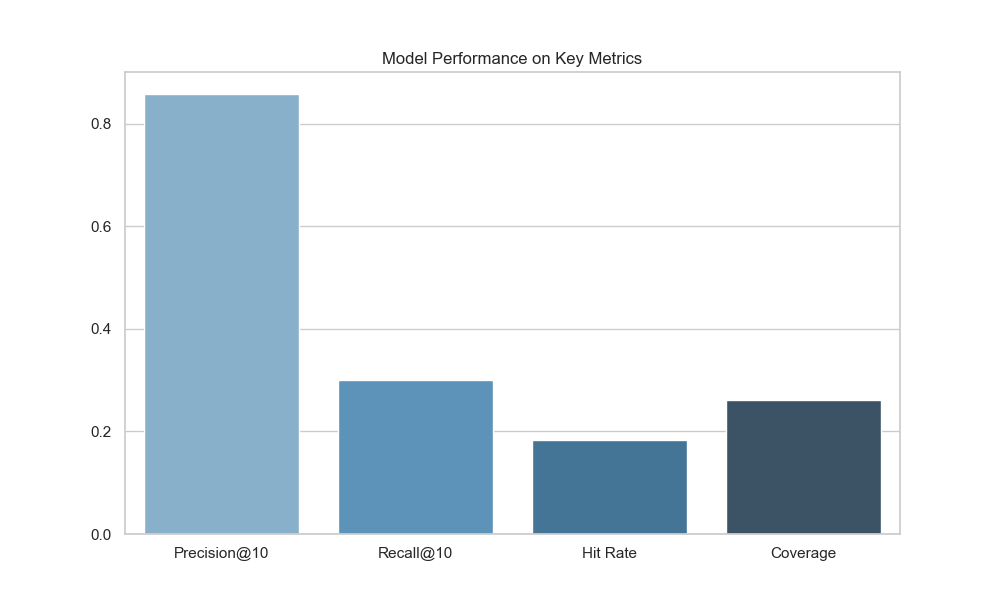
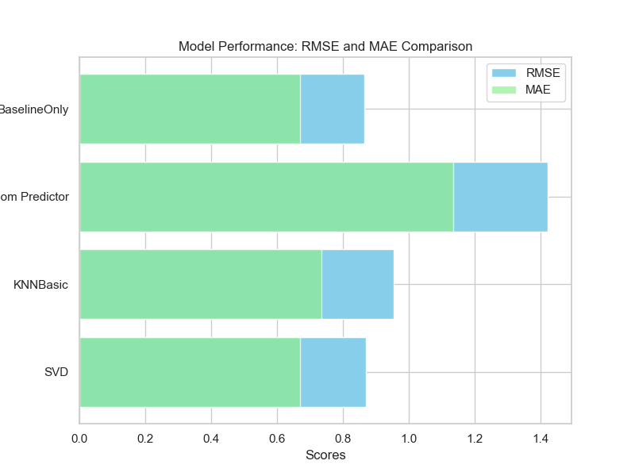

# MovieLens Recommender System

This project implements a **hybrid recommender system** using the MovieLens dataset. It combines **content-based filtering** and **collaborative filtering** (Singular Value Decomposition - SVD) to provide personalized movie recommendations for users.

## Project Overview

- **Goal**: Build a movie recommendation system that suggests movies based on both user preferences and movie features.
Collaborative Filtering: Recommends movies based on user ratings and similarities.
Content-Based Filtering: Recommends movies based on the similarity of movie attributes (e.g., genres).
Hybrid Approach: Combines the strengths of both collaborative and content-based filtering to improve recommendation accuracy.
- **Dataset**: The [MovieLens dataset](https://grouplens.org/datasets/movielens/) contains information on user ratings and movie metadata like genres.

### Dataset Information:
- **Movies**: Includes movie titles and genres.
- **Ratings**: Contains user IDs, movie IDs, ratings, and timestamps.

## Project Workflow
1. **Data Loading and Preprocessing**:
   - Load `movies.csv` and `ratings.csv` into pandas DataFrames.
   - Clean the dataset, and perform exploratory data analysis (EDA).
   - Merge the ratings and movies datasets to create a combined DataFrame for content-based filtering.

2. **Exploratory Data Analysis (EDA)**:
   - **Univariate Analysis**: Analyze the distribution of ratings and genres.
   - **Bivariate Analysis**: Explore relationships between users' ratings and movie features.

3. **Modeling**:
   - **Collaborative Filtering (SVD)**: Applied Singular Value Decomposition to predict user ratings for unseen movies.
   - **Content-Based Filtering**: Based on movie features like genres, recommend similar movies to users.

4. **Model Performance Metrics**:
   - Evaluated the models using **RMSE** (Root Mean Squared Error) and **MAE** (Mean Absolute Error) for collaborative filtering.
   - For content-based recommendations, we generated movie recommendations based on genre similarity.
   - **Precision@10**, **Recall@10**, **Hit Rate**, and **Coverage** metrics were computed to evaluate the recommendation effectiveness.

## Results Summary

### Content-Based Recommendations:
Examples of recommended movies based on content (genres):
- **Antz (1998)**
- **Toy Story 2 (1999)**
- **Monsters, Inc. (2001)**

### Collaborative Filtering (SVD):
- **RMSE**: 0.87
- **MAE**: 0.68
- **Predicted rating for Movie ID 1**: 3.76

### Hybrid Recommendation:
- **Final hybrid score combining SVD and content-based filtering**: 6.88

### Model Performance Summary:
| Model             | RMSE  | MAE  | Precision@10 | Recall@10 | Hit Rate | Coverage |
|-------------------|-------|------|--------------|-----------|----------|----------|
| **SVD**           | 0.87  | 0.68 | 0.84         | 0.32      | 0.18     | 0.26     |
| **KNNBasic**      | 0.95  | 0.74 | 0.72         | 0.26      | 0.12     | 0.20     |
| **Baseline Only** | 0.87  | 0.67 | 0.83         | 0.31      | 0.17     | 0.25     |





## Future Work

1. **Advanced Hybrid Methods**: Explore weighted combinations of models for better accuracy.
2. **Incorporate More Data**: Add user demographics or implicit feedback like clicks and watch history.
3. **Try New Models**: Implement neural collaborative filtering or deep learning-based recommender systems.
4. **Optimize Hyperparameters**: Use advanced techniques like Bayesian optimization to improve model performance.
5. **Improve Coverage**: Work on increasing diversity in recommendations to ensure a wider variety of items are suggested.

## How to Run the Project
1. Clone the repository:
   ```bash
   git clone https://github.com/himanshu-dandle/MovieLens-Recommender-System.git

## Install the required dependencies
    pip install -r requirements.txt

## Open the Jupyter notebook to view the project
	jupyter notebook notebooks/MovieLens_Recommender_System.ipynb
